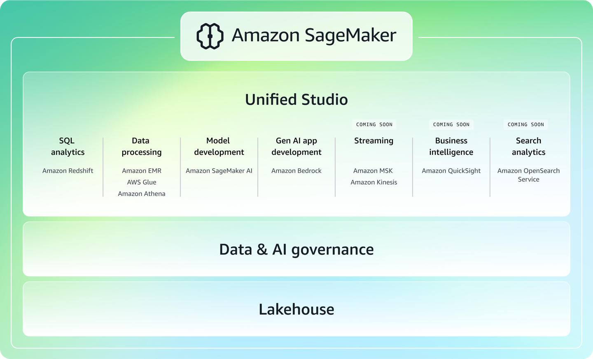

# SageMaker

## まず結論

- `Amazon Bedrock` は既存の基盤モデルを素早く安全に使う側
- `Amazon SageMaker AI` はモデル構築、微調整、配備、監視、ガバナンスまで深く制御する側
- AIP-C01 では、SageMaker は単独知識ではなく、`Bedrock とどう使い分けるか` と `本番運用をどう回すか` が重要

## 名称整理

- `Amazon SageMaker AI` は旧 `Amazon SageMaker`
- 2024-12-03 以降、`Amazon SageMaker` はデータ、分析、AI を含む統合プラットフォーム名
- 試験では旧称と新称が混在しうるが、多くの論点は `SageMaker AI` の機能を指す

### Studio と Unified Studio

- `SageMaker Studio`
  ML 開発に集中するための統合開発環境
- `SageMaker Unified Studio`
  データ、分析、ML、GenAI を横断する統合体験
- `Unified Studio` では Amazon Bedrock も扱える

見分け方:

- ML 開発ツール群そのものの話なら `Studio`
- 組織横断のデータ + 分析 + AI の統合体験なら `Unified Studio`

#### 図で見る Amazon SageMaker の全体像

要点:

- `Unified Studio` の中で `Amazon Bedrock` まで横断できる
- 試験で主に問われる `SageMaker AI` は、この全体像の中の `Model development` 側だと整理すると混同しにくい

出典: [AWS 公式図](https://docs.aws.amazon.com/images/next-generation-sagemaker/latest/userguide/images/What_is_SageMaker_Diagram.png)

## Bedrock と SageMaker AI の境目

### Bedrock を選びやすい場面

- 既存 FM を API で使いたい
- RAG、Guardrails、Agents を素早く組み合わせたい
- インフラ管理をできるだけ減らしたい
- まずアプリを早く出したい

### SageMaker AI を選びやすい場面

- 学習、微調整、推論基盤を細かく制御したい
- 独自コンテナ、独自フレームワーク、独自評価フローを使いたい
- モデル版管理、承認、監視、再現性まで求められる
- MLOps を組みたい

覚え方:

- `使う` なら Bedrock 寄り
- `育てる / 管理する` なら SageMaker AI 寄り

### SageMaker AI が第一候補になりやすい瞬間

- 学習データ、学習ジョブ、評価、承認、配備を一連で管理したい
- モデルを `どの版が、どのデータとコードから作られたか` まで追跡したい
- 独自コンテナ、独自スクリプト、独自推論サーバーを使いたい
- モデルの更新を CI/CD と承認フローに載せたい

要点:

- 問題文に `再現性`、`承認済みモデルのみ本番へ`、`ドリフト監視` が見えたら、Bedrock 単体より SageMaker AI 側の論点が濃くなる
- 逆に `まず業務アプリを早く出したい` だけなら、SageMaker AI は重すぎることが多い

## 全体像

### 1. データ準備

- `Data Wrangler`
  表形式データの取り込み、変換、特徴量化、分析
- `Processing`
  前処理、後処理、評価データ作成をジョブ実行
- `Ground Truth`
  人手ラベリングで高品質な教師データを作る

補足:

- Data Wrangler は現在 `SageMaker Canvas` に統合されている
- 試験では `Data Wrangler` 名で問われる可能性がある

### 2. モデル選定とカスタマイズ

- `JumpStart`
  事前学習済みモデル、サンプル、テンプレートの入口
- `Training jobs`
  学習をフルマネージドで実行
- `Hyperparameter tuning`
  ハイパーパラメータ探索を自動化
- `fine-tuning`
  既存モデルを用途向けに追加学習
- `domain adaptation`
  専門用語、業界文書、社内文体に寄せる
- `instruction-based fine-tuning`
  指示への従い方や出力形式を安定させる
- `parameter-efficient adaptation`
  `LoRA` や `adapters` のように、変更量を絞って効率よく適応させる

見分け方:

- 学習基盤を制御して独自に学習したいなら `Training jobs`
- 最適なパラメータを探索したいなら `Hyperparameter tuning`
- 専門ドメインへの適応が主目的なら `domain adaptation`
- 出力形式や指示追従を整えたいなら `instruction-based fine-tuning`
- 学習コストや配備差分を抑えて適応したいなら `LoRA` / `adapters`

### 3. 配備と推論

#### 推論方式の使い分け

| 方式 | 向く要件 | 主な制約 / 特徴 |
| --- | --- | --- |
| `Real-time Inference` | 低レイテンシ、継続トラフィック | ペイロード最大 25 MB、通常応答 60 秒、ストリーミング最大 8 分 |
| `Serverless Inference` | 断続的・予測しにくいトラフィック | ペイロード最大 4 MB、60 秒、アイドル課金なし、コールドスタートあり |
| `Asynchronous Inference` | 重い処理、大きい入力、待てる処理 | ペイロード最大 1 GB、最大 1 時間、キューイング可能、0 台まで縮退可 |
| `Batch Transform` | オフライン一括推論 | 大規模データをまとめて処理、常時エンドポイント不要 |

#### 追加で押さえるもの

- `Multi-model endpoint`
  多数モデルを 1 エンドポイントで運用
- `Inference pipelines`
  前処理 -> 推論 -> 後処理を 1 本で構成
- `Inference Recommender`
  インスタンスタイプや設定を性能 / コスト観点で比較
- `SageMaker Neo`
  モデルを対象ハードウェア向けにコンパイルし、推論性能を最適化

#### 試験での即断ルール

- 即時応答が必要 -> `Real-time`
- たまにしか使わない -> `Serverless`
- 重くて待てる -> `Async`
- まとめて夜間処理 -> `Batch Transform`
- 多数モデルをまとめたい -> `Multi-model endpoint`
- 前後処理もエンドポイントに含めたい -> `Inference pipelines`
- 特定ハードウェアやエッジ向けに最適化したい -> `Neo`

#### Serverless の注意

- GPU 非対応
- `VPC configuration`、`network isolation`、`data capture`、`Model Monitor`、`inference pipelines`、`Multi-Model Endpoints` など一部機能制限あり
- 断続利用には強いが、常時低遅延用途では不利になりうる

#### Neo の意味

- `Neo` はモデルを一度学習し、対象プラットフォーム向けにコンパイルして推論最適化する機能
- クラウドインスタンスとエッジデバイスの両方が対象
- 論点は `学習` ではなく `推論性能最適化`

### 4. 監視、ガバナンス、MLOps

- `Clarify`
  バイアス検出、説明可能性、責任ある AI
- `Model Monitor`
  本番のデータ品質、モデル品質、bias drift、feature attribution drift を監視
- `Model Registry`
  モデルの版管理、承認状態、配備対象の整理
- `Model Cards`
  用途、制約、評価、リスク、推奨事項の文書化
- `ML Lineage Tracking`
  どのデータ、ジョブ、モデル、エンドポイントから来たか追跡
- `Pipelines`
  前処理 -> 学習 -> 評価 -> 登録 -> 配備を自動化
- `Projects`
  標準化された開発環境、テンプレート、CI/CD をまとめて立ち上げる

### 4.1 カスタムモデルのライフサイクル

- モデル版管理は `Model Registry`
- 承認済みモデルだけを配備対象にする
- `CodePipeline` や `Pipelines` で更新を自動化する
- 配備失敗時は `rollback` を前提にする
- 古いカスタムモデルは retire / replace まで考える

見分け方:

- ドリフト検知 -> `Model Monitor`
- 公平性 / 説明可能性 -> `Clarify`
- 承認済みモデルだけ本番へ -> `Model Registry`
- 監査向け説明書 -> `Model Cards`
- 再現性 / 追跡性 -> `Lineage Tracking`
- 再学習と配備の自動化 -> `Pipelines`
- 開発標準化と MLOps の土台づくり -> `Projects`

## 理解を深める補足

### ライフサイクルでつなげて覚える

1. データを整える
2. 学習や微調整を走らせる
3. 評価して承認する
4. 配備する
5. 本番で監視する
6. 問題があれば戻す

補足:

- SageMaker AI は、単機能の寄せ集めではなく `モデルの変更を安全に本番へ届ける流れ` 全体で理解すると忘れにくい
- `Model Registry` は承認の中心、`Pipelines` は流れの自動化、`Model Monitor` は本番の見張り役と置くと整理しやすい

### 試験で迷いやすい理由

- `Bedrock でも生成AIは作れる` ため、SageMaker AI の必要性が見えにくい
- しかし設問が `深い制御`、`独自学習`、`MLOps`、`監査可能な更新` を求めるときは、SageMaker AI の方が自然
- つまり `早さ` と `制御性` のどちらが主役かを見誤らないことが重要

### 5. まとめて覚える比較

| 論点 | 何を管理するか |
| --- | --- |
| `Model Monitor` | 本番のデータ品質、モデル品質、ドリフト |
| `Clarify` | バイアス、公平性、説明可能性 |
| `Model Registry` | モデル版、承認状態、配備候補 |
| `Model Cards` | モデルの説明書、制約、評価、リスク |
| `Lineage Tracking` | データ、ジョブ、モデルの関係と由来 |
| `Pipelines` | 再現可能な ML ワークフロー |
| `Projects` | チーム標準の MLOps 環境 |

## セキュリティ観点

- IAM による権限制御
- KMS による暗号化
- VPC 配置で閉域構成
- VPC エンドポイントや PrivateLink を使ったプライベート接続
- `network isolation` で外向き通信を制御
- CloudTrail、CloudWatch Logs による監査と追跡
- 暗号化、監査、最小権限を前提に設計する

試験では、機密データ、プライベートネットワーク、インターネット遮断、監査要件が出たら SageMaker のネットワーク分離を疑う。

## 試験で出る周辺論点

- `Unified Studio`
  Bedrock を含むデータ/分析/AI の統合開発体験
- `Studio`
  ML 開発中心の IDE
- `Projects`
  テンプレート付きの MLOps 初期セットアップ
- `Neo`
  推論最適化

重要:

- これらは主役論点ではないが、選択肢の消去に効く
- 特に `Unified Studio` は `Bedrock を含む統合体験`、`Studio` は `ML 開発環境` という区別を押さえる

## 引っかけポイント

- 既存 FM を素早く使うだけなのに SageMaker を選ばない
- `Serverless` を万能と考えない
- `Async` と `Batch Transform` を混同しない
- `Clarify` と `Model Monitor` を混同しない
- `Model Registry` と `Model Cards` を混同しない
- `Studio` と `Unified Studio` を混同しない
- `Neo` を学習最適化と誤認しない
- `LoRA` を RAG の代替と誤認しない
- モデル更新で `rollback` 前提を忘れない

## 試験での判断フロー

1. まず `Bedrock` か `SageMaker AI` かを切る
2. 次にフェーズを切る
   `データ準備 / ラベリング / カスタマイズ / 配備 / 監視 / ガバナンス`
3. 配備なら推論方式を切る
   `Real-time / Serverless / Async / Batch`
4. 最後に本番要件を切る
   `低レイテンシ / コスト / 監査 / 承認 / ドリフト / 再現性`

## Active Recall

- Bedrock と SageMaker AI の違いは何か
- Studio と Unified Studio の違いは何か
- JumpStart はどのフェーズで使うか
- Training jobs と Hyperparameter tuning は何をするか
- domain adaptation と instruction-based fine-tuning の違いは何か
- `LoRA` / `adapters` はどんな場面で有効か
- Real-time、Serverless、Async、Batch Transform はどう使い分けるか
- Neo は何を最適化する機能か
- Model Monitor と Clarify は何が違うか
- Model Registry、Model Cards、Lineage Tracking はそれぞれ何を管理するか
- Projects と Pipelines の違いは何か
- カスタムモデルの配備で `rollback` が重要な理由は何か
- Serverless Inference の制限として何が重要か
- 機密データを扱うときに SageMaker で意識する制御は何か

### 答えと解説

1. Bedrock は既存 FM を素早く安全に使うサービスで、SageMaker AI は学習、微調整、配備、監視、ガバナンスまで深く制御するサービスです。試験では `使うなら Bedrock、育てる/管理するなら SageMaker AI` で切ると整理しやすいです。
2. `Studio` は ML 開発中心の IDE、`Unified Studio` はデータ、分析、ML、GenAI を横断する統合体験です。Bedrock も含めて横断的に扱うなら `Unified Studio` の論点です。
3. `JumpStart` はモデル選定と導入の入口で使います。事前学習済みモデルやサンプル、テンプレートを素早く試し、学習や配備の出発点を作る役割です。
4. `Training jobs` は学習そのものを実行し、`Hyperparameter tuning` はその学習設定の探索を自動化します。前者はモデルを育てる処理、後者は最適な設定を探す処理です。
5. `domain adaptation` は専門文書や業界用語に寄せるための適応で、`instruction-based fine-tuning` は指示追従や出力形式を安定させるための調整です。知識寄りか、振る舞い寄りかで切り分けます。
6. `LoRA` や `adapters` は、モデル全体を大きく作り変えずに差分だけで適応したいときに有効です。学習コスト、保存量、更新速度を抑えたい場面で効きます。
7. 低レイテンシの常時応答なら `Real-time`、断続利用でアイドル課金を避けたいなら `Serverless`、重くて待てる処理なら `Asynchronous`、夜間などの一括処理なら `Batch Transform` です。リアルタイム性と処理量で判断します。
8. `Neo` は推論性能を最適化する機能です。学習ではなく、対象ハードウェア向けにモデルをコンパイルして速度や効率を改善する論点です。
9. `Model Monitor` は本番の品質やドリフト監視、`Clarify` はバイアス検出や説明可能性の支援です。監視対象が本番品質か、責任ある AI の観点かで区別します。
10. `Model Registry` はモデル版と承認状態、`Model Cards` はモデルの説明書と制約、`Lineage Tracking` はデータ、ジョブ、モデルの由来を管理します。承認、文書化、追跡性の3役を分けて覚えます。
11. `Projects` は標準化された MLOps 環境の立ち上げ、`Pipelines` は前処理から配備までのワークフロー自動化です。土台づくりか、実行フロー自動化かの違いです。
12. カスタムモデルの更新では、性能低下や不整合が起きたらすぐ戻せるように `rollback` を前提にします。版管理、承認、配備自動化を分けておくと安全です。
13. `Serverless Inference` では GPU 非対応、ペイロード上限、コールドスタート、一部機能制限が重要です。断続利用には強い一方で、常時低遅延や高度な構成には不向きな場合があります。
14. 機密データを扱うなら、IAM、KMS、VPC、PrivateLink、network isolation、監査ログを意識します。要は、最小権限、閉域、暗号化、追跡可能性をそろえることが重要です。

## 公式情報

- [What is Amazon SageMaker AI?](https://docs.aws.amazon.com/sagemaker/latest/dg/whatis.html)
- [What is Amazon SageMaker?](https://docs.aws.amazon.com/next-generation-sagemaker/latest/userguide/what-is-sagemaker.html)
- [What is Amazon SageMaker Unified Studio?](https://docs.aws.amazon.com/sagemaker-unified-studio/latest/userguide/what-is-sagemaker-unified-studio.html)
- [Amazon SageMaker Studio](https://docs.aws.amazon.com/sagemaker/latest/dg/studio-updated.html)
- [Amazon Bedrock or Amazon SageMaker AI? Decision Guide](https://docs.aws.amazon.com/decision-guides/latest/bedrock-or-sagemaker/bedrock-or-sagemaker.html)
- [Inference options in Amazon SageMaker AI](https://docs.aws.amazon.com/sagemaker/latest/dg/deploy-model-options.html)
- [Deploy models with Amazon SageMaker Serverless Inference](https://docs.aws.amazon.com/sagemaker/latest/dg/serverless-endpoints.html)
- [Inference pipelines in Amazon SageMaker AI](https://docs.aws.amazon.com/sagemaker/latest/dg/inference-pipelines.html)
- [Amazon SageMaker Inference Recommender](https://docs.aws.amazon.com/sagemaker/latest/dg/inference-recommender.html)
- [Model performance optimization with SageMaker Neo](https://docs.aws.amazon.com/sagemaker/latest/dg/neo.html)
- [Prepare ML Data with Amazon SageMaker Data Wrangler](https://docs.aws.amazon.com/sagemaker/latest/dg/data-wrangler.html)
- [Training data labeling using humans with Amazon SageMaker Ground Truth](https://docs.aws.amazon.com/sagemaker/latest/dg/sms.html)
- [SageMaker JumpStart pretrained models](https://docs.aws.amazon.com/sagemaker/latest/dg/studio-jumpstart.html)
- [Data and model quality monitoring with Amazon SageMaker Model Monitor](https://docs.aws.amazon.com/sagemaker/latest/dg/model-monitor.html)
- [Amazon SageMaker Model Cards](https://docs.aws.amazon.com/sagemaker/latest/dg/model-cards.html)
- [Model Registry Models, Model Versions, and Model Groups](https://docs.aws.amazon.com/sagemaker/latest/dg/model-registry-models.html)
- [Amazon SageMaker ML Lineage Tracking](https://docs.aws.amazon.com/sagemaker/latest/dg/lineage-tracking.html)
- [Amazon SageMaker Model Registry](https://docs.aws.amazon.com/sagemaker/latest/dg/model-registry.html)
- [Amazon SageMaker Pipelines](https://docs.aws.amazon.com/sagemaker/latest/dg/pipelines.html)
- [AWS CodePipeline](https://docs.aws.amazon.com/codepipeline/latest/userguide/welcome.html)
- [What is a SageMaker AI Project?](https://docs.aws.amazon.com/sagemaker/latest/dg/sagemaker-projects-whatis.html)
