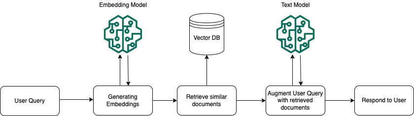

# Bedrock

## まず結論

- `Amazon Bedrock` は、複数の基盤モデルを統一的に使い、`RAG`、`Guardrails`、`Agents`、`Flows`、`Evaluations`、`Prompt management` までまとめて扱える中核サービス
- AIP-C01 では、`どのモデルを使うか`、`どの Bedrock 機能を主役にするか`、`どう安全かつ継続運用するか` が中心論点
- 暗記は `使う -> 知識を足す -> 実行へつなぐ -> 守る -> 測る -> 最適化する` の順で整理すると崩れにくい

## Bedrock を 7 層で整理する

| 層 | 何を決めるか | 主な機能 |
| --- | --- | --- |
| モデル層 | どのモデルを使うか | FM、Marketplace、Custom model import |
| 推論層 | どの API で呼ぶか | Responses、Chat Completions、Converse、InvokeModel |
| プロンプト層 | プロンプトをどう資産化するか | Prompt management、Prompt optimization、Prompt caching |
| 知識拡張層 | 独自データをどう使うか | Knowledge Bases、reranking、structured data |
| 実行制御層 | 推論をどう業務処理へつなぐか | structured outputs、tool use、Agents、Flows |
| 安全・評価層 | 何を防ぎ、何を測るか | Guardrails、Evaluations |
| 運用最適化層 | コスト、性能、運用をどう安定化するか | CountTokens、Batch inference、Provisioned Throughput、Inference profiles、logging |

## 問題文から決める順番

1. まず `答えるだけ` か `実行まで進む` かを切る
2. 次に `独自知識が必要か` を切る
3. そのうえで `安全制御` と `評価` を足す
4. 最後に `コスト` と `性能` を詰める

要点:

- Bedrock は機能が広いので、機能一覧から覚えると混乱しやすい
- 実務でも試験でも、`推論 -> RAG -> ツール実行 -> Guardrails -> 評価 -> 最適化` の順に必要機能を足す方が自然
- 比較問題では `主役機能` と `補助機能` を分けると誤答を外しやすい

## 1. モデルを使う

### モデル選択の観点

- モダリティ
  テキスト、画像、埋め込み、マルチモーダル
- 性能
  精度、推論速度、文脈長、tool use 対応
- 運用条件
  利用リージョン、価格、Provisioned Throughput の可否
- 互換性
  Converse、Guardrails、prompt caching、streaming など必要機能と両立するか

### モデルアクセスの前提

- モデル利用条件は一律ではない
- 一部モデルは AWS Marketplace 側の権限やサブスクリプションが前提
- モデル提供元によっては、初回の利用申請やユースケース提出が必要な場合がある

要点:

- 試験では `Bedrock なら全部すぐ使える` と考えない
- `モデルごとに前提条件が違う` と整理しておく方が安全

### データ保護の基本

- Bedrock は、既定ではプロンプトや補完結果を保存せず、AWS のモデル学習にも使わない
- ただし、`model invocation logging` を有効化すると、入力と出力を `CloudWatch Logs` や `Amazon S3` に配信できる

要点:

- `既定で保存しない` と `利用者がログ保存を有効化できる` は別の話
- 監査要件がある設問では、この切り分けが重要

### PoC と標準化

- いきなり本番へ進まず、まず `technical proof-of-concept` で実現性、性能、業務価値を確かめる
- PoC では `正答率` だけでなく、`レイテンシ`、`コスト`、`安全制御のかけやすさ`、`運用のしやすさ` を見る
- 共通部品は `プロンプトテンプレート`、`入出力形式`、`Guardrails 方針`、`logging` まで標準化する

## 2. 推論を呼ぶ

### API の使い分け

| API | 向く場面 | ざっくり理解 |
| --- | --- | --- |
| `Responses API` | 新規の会話アプリ、OpenAI 互換、サーバー側ツール | 新しく始めるなら有力 |
| `Chat Completions API` | OpenAI 互換コードの移植、会話履歴を自前管理 | 既存資産の移行向け |
| `Converse API` | 複数モデルを統一形式で扱いたい | Bedrock 標準の会話 API |
| `InvokeModel` / `InvokeModelWithResponseStream` | 埋め込み、画像生成、モデル固有パラメータを直接使いたい | 生のモデル呼び出し |

### 低レベル API と共通 API の違い

- `InvokeModel` はモデル固有の入出力形式を意識する低レベル寄りの API
- `Converse` はメッセージ形式に寄せた共通 API で、会話アプリやモデル差し替えを整理しやすい

要点:

- 会話アプリでは `Converse` を中心に整理すると、Guardrails や Prompt management ともつながりやすい
- 埋め込みや画像生成のようにモデル固有形式が強い場面では `InvokeModel` を考える

### control plane と runtime の見分け方

| 領域 | 主な用途 | 代表例 |
| --- | --- | --- |
| `bedrock` | モデル、カスタマイズ、各種管理 | `ListFoundationModels` |
| `bedrock-runtime` | モデル推論 | `Converse`、`InvokeModel`、`CountTokens` |
| `bedrock-agent` | Agents、Knowledge Bases、Flows の構築 | `CreateAgent`、`CreateFlow` |
| `bedrock-agent-runtime` | Agents、Flows、KB の実行 | `InvokeAgent`、`InvokeFlow`、`RetrieveAndGenerate` |

## 3. プロンプトを管理する

### Prompt management

- プロンプトを保存する
- 変数を持たせる
- 推論設定を含めて管理する
- バリアント比較をしやすくする
- バージョンを切って本番で固定参照する

### 変数、バリアント、バージョン

- 変数は再利用のための差し込みポイント
- バリアントは比較用の別案
- バージョンは本番利用する固定版

要点:

- 試験では `プロンプトを保存できる` より `開発用 DRAFT と本番用 version を分ける` 方が重要

### Converse から prompt version を呼ぶときの注意

- `modelId` に prompt version ARN を指定して使う
- このとき呼び出し側で自由に付けられない項目がある
- 代表的に `additionalModelRequestFields`、`inferenceConfig`、`system`、`toolConfig` は付けられない
- `messages` を渡した場合は、保存済みメッセージの後ろへ追加される

### Prompt optimization

- 既存プロンプトを解析して改善案を出す機能
- そのまま本番採用するのではなく、評価データや人手レビューで比較する

### Prompt caching

- 変わらない先頭部分の長いプロンプトをキャッシュし、後続リクエストの入力コストと遅延を下げる
- 既定の TTL は `5 分`
- 一部のモデルでは `1 時間 TTL` を使える
- prefix が一致しないとヒットしにくいので、共通部分を先頭に寄せる

要点:

- `Prompt management` は資産化
- `Prompt caching` は推論最適化
- 役割が違う

## 4. 独自データで答えさせる

### Knowledge Bases

- Bedrock で RAG を構成する中核機能
- データ取り込み、埋め込み、チャンク分割、検索、再ランキングをまとめて扱える
- `retrieve only` と `retrieve and generate` を分けて考えると整理しやすい

#### 図で見る RAG の実行時フロー

要点:

- `質問を埋め込み化 -> 類似文書を取得 -> 取得文脈で質問を拡張 -> FM が回答` の順で動く
- `最新文書を根拠付きで使いたい` 問題では、この流れを前提に `Knowledge Bases` を第一候補に置く

出典: [AWS 公式図](https://docs.aws.amazon.com/images/bedrock/latest/userguide/images/kb/rag-runtime.png)

### 検索品質で重要なもの

- `chunking`
  小さすぎると文脈不足、大きすぎるとノイズ増加
- `metadata`
  絞り込み、出典説明、再ランキングに効く
- `reranking`
  初回検索結果の順位改善に使う
- `topK`
  取りこぼしとノイズ混入の両方に効く

### ベクトルストアの考え方

#### OpenSearch Service

- ハイブリッド検索、集計、高度な検索設計に向く
- 検索機能の豊富さを重視する場合の第一候補
- フィルタをどこで効かせるかで、返せる件数と recall が変わる
- `OpenSearch Serverless` と `OpenSearch Managed clusters` は、Knowledge Bases でバイナリベクトルを扱える代表候補

#### S3 Vectors

- 低コストかつ運用の軽さを重視するときに向く
- 低頻度検索や大規模保存と相性がよい
- 代表論点は `次元数 1-4096`、`topK 最大 100`、`PutVectors 1 回最大 500`、`1 インデックス最大 20 億ベクトル`、`1 バケット最大 10,000 インデックス`
- メタデータは `filterable` と `non-filterable` を使い分ける
- `non-filterable` にしたキーは後から `filterable` に戻せない

要点:

- `検索機能の豊富さ` が主役なら `OpenSearch`
- `保存コストと運用の軽さ` が主役なら `S3 Vectors`

### データ取り込みと更新追随

#### データの形を見分ける

- 構造化データ
  列と型が明確なテーブル中心
- 半構造化データ
  JSON やタグ付き文書のように項目名が手がかりになる
- 非構造化データ
  PDF、Office 文書、画像、音声、動画など、抽出や整形が先に必要

#### 取り込み前処理

- `Glue Data Catalog`
  メタデータ管理
- `Glue Data Quality`
  欠損や異常値の検証
- `Textract`
  PDF や帳票から文字や表を抽出
- `Transcribe`
  音声をテキスト化
- `Comprehend`
  PII やエンティティ抽出の前処理
- `Bedrock Data Automation`
  非構造データを抽出、標準化して後続処理しやすくする

#### データソースと同期

- Knowledge Bases の同期は差分反映の考え方で動く
- 元データの追加、変更、削除があったら再同期で取り込む
- S3 イベントで `Lambda` を起動し、前処理や同期を自動化できる
- 複数ステップなら `Step Functions` でまとめる
- RDB の差分は `AWS DMS` の `CDC`、DynamoDB なら `Streams`、定期バッチなら `Glue job bookmarks` を使い分ける

#### 監視

- 取り込みは失敗する前提で設計する
- `CloudWatch Logs`、`Step Functions` の実行履歴、Knowledge Bases の同期ログを見られるようにする

### RAG と fine-tuning の違い

- `RAG`
  推論時に外部知識を引く
- `Fine-tuning`
  モデルの振る舞いを学習で変える
- `Continued pre-training`
  ラベルなし文書でドメイン慣れを進める

覚え方:

- 最新知識を使いたい -> `Knowledge Bases`
- 出力形式や口調を変えたい -> `Fine-tuning`
- ドメイン知識を広くなじませたい -> `Continued pre-training`

## 5. 業務処理へつなぐ

### structured outputs

- JSON などの決まった形式で出力させる
- 後続システムで機械処理しやすくする
- text-to-SQL や更新系処理では特に重要

### tool use

- モデルが外部ツールや API を呼ぶ前提で応答を構成する
- 生成だけで終わらず、`検索`、`予約`、`更新`、`計算` へ進められる

### Agents

- 会話しながら計画し、必要なツールを選び、完了まで進める
- 状況依存のツール選択や聞き返しに向く

### Flows

- 決め打ち寄りのワークフローをノードでつなぐ
- 条件分岐、Prompt ノード、Knowledge Bases ノード、Lambda ノードなどを組み合わせる

### 覚え方

- `まず JSON で安定させたい` -> `structured outputs`
- `外部 API を呼びたい` -> `tool use`
- `対話しながら判断` -> `Agents`
- `順序が決まっている` -> `Flows`

## 6. 安全に使う

### Guardrails

- 入力と出力の両方に安全制御をかける
- `content filters`
- `denied topics`
- `word filters`
- `sensitive information filters`
- `contextual grounding checks`
- `automated reasoning checks`
- `prompt attack detection`

### contextual grounding checks

- 参照ソースとユーザー質問を前提に、回答が根拠に基づくかを確認する
- 要約、言い換え、質問応答に向く
- Conversational QA や一般的な chatbot をそのまま対象にする機能ではない

### automated reasoning checks

- 定義したルールに照らして論理整合性を検証する
- ルール検証には強いが、これだけで prompt injection を防ぐ前提にはしない
- 制約を確認してから使う
- 一般チャットやストリーミング前提の用途では、適用可否を先に確認する

### ApplyGuardrail

- 既存アプリの任意の入出力にも Guardrails を適用できる
- Bedrock 推論 API を直接使わない構成でも安全制御をかけたいときに有効

要点:

- `Guardrails` は強いが万能ではない
- 権限分離、入力検証、出力検証、監査と組み合わせる

## 7. 品質を測る

### Evaluations

- モデル比較
- プロンプト比較
- RAG 比較
- `LLM-as-a-judge`
- `human-based evaluation`

### 使い分け

- `LLM-as-a-judge`
  高速に大量比較したい
- `human-based evaluation`
  微妙な品質差、文体、UX 差を見たい

### Guardrails との違い

- `Guardrails`
  実行時に防ぐ
- `Evaluations`
  事前に測る

## 8. モデルをカスタマイズする

### まず切り分け

- 知識を追加したいのか
- 出力形式や分類の癖を整えたいのか
- 小型モデルへ能力を移したいのか
- 採点基準に沿って答え方を磨きたいのか

### 手法の比較

| 手法 | 何を与えるか | 何を変えるか | 向く場面 |
| --- | --- | --- | --- |
| `Fine-tuning` | 入力と望ましい出力のペア | 応答形式、口調、分類 | 定型応答、形式固定 |
| `Continued pre-training` | ラベルなし文書 | ドメイン知識、専門用語、文体 | 専門分野適応 |
| `Distillation` | 教師モデルへのプロンプト群 | 高性能モデルの振る舞いを小型モデルへ移す | 品質を保って高速化、低コスト化 |
| `Reinforcement fine-tuning` | プロンプトと報酬関数 | 採点基準に沿って答え方を磨く | コード生成、SQL、要約、RAG 忠実性 |

### カスタマイズ前に止まって考えること

1. その課題は検索で解けないか
2. schema や tool use で解けないか
3. 評価基準は定義できているか
4. rollback できるか

## 9. コストと性能を最適化する

### CountTokens

- 入力トークン数を事前に見積もる
- 長文抑制、コスト見積もり、上限管理に使う

### token とクォータ

- Bedrock ではコストだけでなく `TPM`、`TPD`、`RPM` も重要
- `max_tokens` は単なる出力上限ではなく、初期クォータ消費にも効く
- 過大な `max_tokens` は、同時実行数を落としやすい

### burndown rate

- モデルによっては、出力 1 token がクォータ上は 1 以上の重みで消費される
- 現行の Bedrock ドキュメントでは、Anthropic Claude 3.7 以降の一部モデルで出力側の burndown rate が `5x`
- 請求は実 token ベースでも、クォータ消費は別計算になることがある

### Prompt caching の運用論点

- 共通 prefix を先頭に寄せる
- `CacheReadInputTokens` と `CacheWriteInputTokens` を監視する
- 一部の入力コストは減っても、キャッシュヒットしない設計では効かない

### Batch inference

- 大量データをまとめて非リアルタイム処理する
- 夜間一括要約、レビュー分類、議事録処理に向く

### Inference profiles

- アプリケーション単位のトラフィック管理、利用メトリクス、タグ付けに使う
- cross-Region inference とつながる

### Intelligent prompt routing

- 問い合わせごとに、品質とコストのバランスが良いモデルへ振り分ける考え方
- 難しい問い合わせだけ上位モデルへ回したいときに向く
- 現行ドキュメントでは prompt router を使って routing 条件や fallback を定義する
- 最適化は英語プロンプト中心と整理する

### Cross-Region inference

- 複数リージョンへルーティングして、可用性やスループットを上げる
- どのリージョンへ飛ぶか、データ所在要件をどう扱うかを必ず確認する

### Provisioned Throughput

- 安定スループットや予測可能な本番性能が必要なときの選択肢
- 高ボリューム本番や厳しいレイテンシ要件向け
- `Inference profiles` と併用しない前提で整理する

## 10. セキュリティ、監査、監視

### セキュリティ

- IAM による最小権限
- KMS による暗号化
- VPC エンドポイント / PrivateLink によるプライベート接続
- データ保護とリージョン要件の確認

### 監査

- `CloudTrail`
  誰がどの AWS API を呼んだかを追う
- `model invocation logging`
  推論の入力と出力を追う

### 監視

- `CloudWatch`
  レイテンシ、エラー、スロットリング、トークン使用量、キャッシュ関連指標を追う

### 試験での見分け方

- プライベート接続 -> `PrivateLink`
- API 操作監査 -> `CloudTrail`
- 推論内容の監査 -> `model invocation logging`
- 運用メトリクス監視 -> `CloudWatch`

## 11. Bedrock Data Automation

- 文書、画像、音声、動画などの非構造データから、後続処理しやすい情報を抽出、標準化するための機能

### Knowledge Bases との違い

- `Knowledge Bases`
  検索して答えるための RAG 基盤
- `Bedrock Data Automation`
  非構造データを抽出、変換して使いやすくする

## 12. よくあるユースケース

### 社内ドキュメント検索チャット

- 第一候補: `Knowledge Bases + Converse/Responses + Guardrails`
- fine-tuning より RAG が自然

### 予約や申請を処理する業務エージェント

- 第一候補: `Agents + tool use + Lambda/API + Guardrails`

### 固定手順の文書処理フロー

- 第一候補: `Flows + structured outputs`

### 大量データの夜間一括処理

- 第一候補: `Batch inference`

### 長い共通コンテキストを何度も使うアシスタント

- 第一候補: `Prompt caching`

## 13. 混同しやすい論点

| 論点 | 違い |
| --- | --- |
| `RAG` vs `Fine-tuning` | 外部知識を引くか、モデル自体を学習で変えるか |
| `Knowledge Bases` vs `Agents` | 検索して答えるか、ツール実行まで進むか |
| `Agents` vs `Flows` | 状況に応じて判断するか、順序が固定か |
| `Prompt management` vs `Prompt caching` | 資産化か、推論最適化か |
| `Guardrails` vs `Evaluations` | 実行時に防ぐか、事前に測るか |
| `OpenSearch` vs `S3 Vectors` | 検索機能の豊富さか、低コストで軽い運用か |
| `CloudTrail` vs `model invocation logging` | API 操作監査か、推論入出力監査か |
| `Intelligent prompt routing` vs `graceful degradation` | 平常時の最適化か、障害時の縮退運転か |
| `Batch inference` vs `Provisioned Throughput` | 一括処理か、常時性能保証か |

## 14. 試験での判断フロー

1. まず目的を切る
   `推論 / 検索 / ツール実行 / 安全制御 / 評価 / カスタマイズ / 最適化`
2. モデル選定前に確認する
   `アクセス条件 / リージョン / データ保護 / PoC`
3. 独自知識が必要なら切る
   `Knowledge Bases` か `Fine-tuning` か
4. 実行制御が必要なら切る
   `structured outputs / tool use / Agents / Flows`
5. 安全性が必要なら切る
   `Guardrails / IAM / PrivateLink / logging`
6. コストと性能を切る
   `CountTokens / Prompt caching / Batch / Provisioned Throughput / Inference profiles`

## Active Recall

- Responses、Chat Completions、Converse、InvokeModel はどう使い分けるか
- Bedrock の既定データ保護と `model invocation logging` の違いは何か
- Prompt management と Prompt caching は何が違うか
- prompt version を `Converse` で使うときの注意は何か
- Knowledge Bases で重要な設計要素は何か
- `OpenSearch` と `S3 Vectors` はどう切り分けるか
- データ取り込み前処理では何を見るか
- `structured outputs`、`tool use`、`Agents`、`Flows` はどう違うか
- Guardrails で何を制御できるか
- `Evaluations` と `Guardrails` の違いは何か
- `Fine-tuning`、`Continued pre-training`、`Distillation`、`Reinforcement fine-tuning` はどう切り分けるか
- `CountTokens`、`Prompt caching`、`Provisioned Throughput`、`Inference profiles` はどの要件で使うか
- `burndown rate` と `Intelligent prompt routing` は何の論点か
- `PrivateLink`、`CloudTrail`、`model invocation logging`、`CloudWatch` は何を守り、何を観測するか

### 答えと解説

1. `Responses` は新規会話アプリ、`Chat Completions` は OpenAI 互換コードの移植、`Converse` は複数モデルを統一形式で扱う用途、`InvokeModel` は埋め込みや画像生成などの直接呼び出しに向きます。
2. 既定ではプロンプトや補完結果を保存しません。一方 `model invocation logging` を有効化すると、利用者が指定した保存先へ入力と出力を配信できます。
3. `Prompt management` はプロンプトの保存、変数化、比較、版管理です。`Prompt caching` は同じ長い先頭部分を再利用して入力コストと遅延を下げる仕組みです。
4. `modelId` に prompt version ARN を使います。このとき呼び出し側で自由に追加できない設定があり、`messages` は保存済みメッセージの後ろへ追加されます。
5. チャンク分割、埋め込み、メタデータ、topK、再ランキング、データソース設計です。RAG は検索前段で大きく差がつきます。
6. 検索機能の豊富さや高度な検索体験を重視するなら `OpenSearch`、低コストと運用の軽さを重視するなら `S3 Vectors` です。
7. 構造化、半構造化、非構造化を見分け、必要なら `Glue Data Catalog`、`Glue Data Quality`、`Textract`、`Transcribe`、`Comprehend`、`Bedrock Data Automation` を前処理へ入れます。更新追随では同期、差分検知、自動化、監視を一緒に考えます。
8. `structured outputs` は形式固定、`tool use` は外部 API 実行、`Agents` は状況依存の計画とツール選択、`Flows` は固定手順のワークフローです。
9. 禁止トピック、単語フィルタ、PII、grounding、論理検証、prompt attack detection などです。入力と出力の両方に安全策をかけます。
10. `Evaluations` は事前比較、`Guardrails` は実行時制御です。測る機能か、防ぐ機能かで切ります。
11. `Fine-tuning` は正解ペア、`Continued pre-training` はラベルなし文書、`Distillation` は教師モデルの応答、`Reinforcement fine-tuning` は報酬関数が中心です。`何を与えるか` で見分けると整理しやすいです。
12. `CountTokens` は事前見積もり、`Prompt caching` は共通 prefix 再利用、`Provisioned Throughput` は安定性能確保、`Inference profiles` はアプリ単位の管理と cross-Region 推論です。
13. `burndown rate` はクォータ消費の重み、`Intelligent prompt routing` は平常時に品質とコストのバランスが良いモデルへ振り分ける論点です。
14. `PrivateLink` はプライベート接続、`CloudTrail` は API 操作監査、`model invocation logging` は推論入出力監査、`CloudWatch` は性能やエラーなどの運用監視です。

## 公式情報

- [What is Amazon Bedrock?](https://docs.aws.amazon.com/bedrock/latest/userguide/what-is-bedrock.html)
- [Foundation models supported in Amazon Bedrock](https://docs.aws.amazon.com/bedrock/latest/userguide/models-supported.html)
- [Model access](https://docs.aws.amazon.com/bedrock/latest/userguide/model-access.html)
- [Data protection in Amazon Bedrock](https://docs.aws.amazon.com/bedrock/latest/userguide/data-protection.html)
- [Inference request flow and APIs for Amazon Bedrock](https://docs.aws.amazon.com/bedrock/latest/userguide/inference-api.html)
- [Prompt management in Amazon Bedrock](https://docs.aws.amazon.com/bedrock/latest/userguide/prompt-management.html)
- [Use a prompt from Prompt management](https://docs.aws.amazon.com/bedrock/latest/userguide/prompt-management-test.html)
- [Optimize prompt variants](https://docs.aws.amazon.com/bedrock/latest/userguide/prompt-management-optimize.html)
- [Optimize costs using prompt caching in Amazon Bedrock](https://docs.aws.amazon.com/bedrock/latest/userguide/prompt-caching.html)
- [Knowledge Bases for Amazon Bedrock](https://docs.aws.amazon.com/bedrock/latest/userguide/knowledge-base.html)
- [Set up your data for a knowledge base](https://docs.aws.amazon.com/bedrock/latest/userguide/kb-data-source-sync-ingest.html)
- [Vector stores for Knowledge Bases for Amazon Bedrock](https://docs.aws.amazon.com/bedrock/latest/userguide/knowledge-base-supported.html)
- [Amazon S3 Vectors limitations and restrictions](https://docs.aws.amazon.com/AmazonS3/latest/userguide/s3-vectors-limitations.html)
- [Metadata filtering for Amazon S3 Vectors](https://docs.aws.amazon.com/AmazonS3/latest/userguide/s3-vectors-metadata-filtering.html)
- [Guardrails for Amazon Bedrock](https://docs.aws.amazon.com/bedrock/latest/userguide/guardrails.html)
- [Contextual grounding check](https://docs.aws.amazon.com/bedrock/latest/userguide/guardrails-contextual-grounding-check.html)
- [Automated reasoning checks](https://docs.aws.amazon.com/bedrock/latest/userguide/guardrails-automated-reasoning-checks.html)
- [ApplyGuardrail](https://docs.aws.amazon.com/bedrock/latest/APIReference/API_runtime_ApplyGuardrail.html)
- [Model evaluation jobs](https://docs.aws.amazon.com/bedrock/latest/userguide/evaluation.html)
- [Model customization](https://docs.aws.amazon.com/bedrock/latest/userguide/custom-models.html)
- [Count tokens for Amazon Bedrock](https://docs.aws.amazon.com/bedrock/latest/userguide/count-tokens.html)
- [How tokens are counted in Amazon Bedrock](https://docs.aws.amazon.com/bedrock/latest/userguide/quotas-token-burndown.html)
- [Understanding intelligent prompt routing in Amazon Bedrock](https://docs.aws.amazon.com/bedrock/latest/userguide/prompt-routing.html)
- [Provisioned Throughput for Amazon Bedrock](https://docs.aws.amazon.com/bedrock/latest/userguide/prov-throughput.html)
- [Use inference profiles in Amazon Bedrock](https://docs.aws.amazon.com/bedrock/latest/userguide/inference-profiles.html)
- [Batch inference in Amazon Bedrock](https://docs.aws.amazon.com/bedrock/latest/userguide/batch-inference.html)
- [Monitoring model invocation using logs](https://docs.aws.amazon.com/bedrock/latest/userguide/model-invocation-logging.html)
- [Monitor Amazon Bedrock using CloudWatch](https://docs.aws.amazon.com/bedrock/latest/userguide/monitoring.html)
- [Logging Amazon Bedrock API calls using AWS CloudTrail](https://docs.aws.amazon.com/bedrock/latest/userguide/logging-using-cloudtrail.html)
- [Bedrock Data Automation](https://docs.aws.amazon.com/bedrock/latest/userguide/bda.html)
