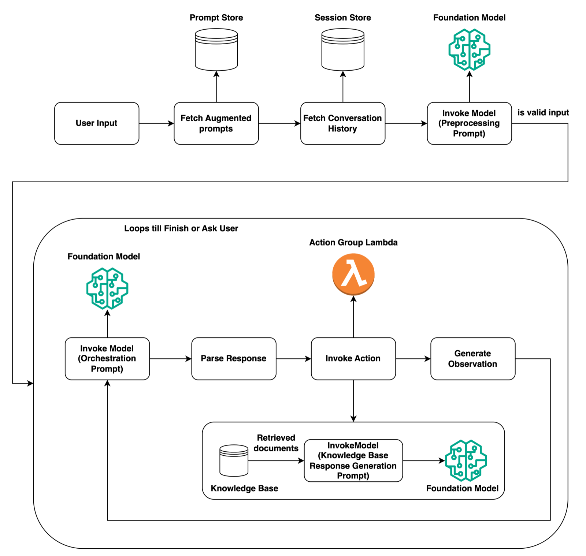

# 実装と統合

## まず結論

- Domain 2 は `FM をどう業務に組み込むか` の問題
- 論点は `API 呼び出し`、`tool use`、`Agents`、`Flows`、`Step Functions`、`既存システム統合`
- 問題文ではサービス名より `要件に対してどの構成が自然か` を問われる

## このドメインでまず切ること

### 1. 推論だけか、実行まで必要か

- 推論だけでよい -> `Converse`、`Responses`、`InvokeModel`
- 外部 API 実行まで必要 -> `tool use`、`Agents`
- 手順が固定 -> `Flows`、`Step Functions`

### 2. 会話か、バックエンド処理か

- 会話アプリ -> 会話履歴、ストリーミング、状態管理が重要
- バックエンド処理 -> 非同期、再試行、イベント駆動が重要

### 3. 1 回で終わるか、複数ステップか

- 単発推論 -> シンプルな API 統合
- 複数ステップ -> オーケストレーションが必要

## 構成を選ぶときの考え方

### まず `自由度` と `制御性` を比べる

- `Agents` は自由度が高いが、結果のばらつきや安全制御を強く意識する
- `Flows` は固定手順に強いが、状況依存の判断には弱い
- `Step Functions` は制御性、再試行、監査、承認に強い

要点:

- 固定手順なのに `Agents` を選ぶ、単純な同期 API なのに `Step Functions` を選ぶ、が典型的な誤り
- 実装問題では `高機能なもの` より `過不足がないもの` を選ぶ

## 1. エージェンティック AI とツール連携

### tool use

- モデルが使うツールを判断し、必要な引数を組み立てる考え方
- 予約、検索、計算、CRM 更新などに向く
- 重要なのは `何を呼べるか` と `どこまで権限を与えるか`

### Agents

- 会話しながら計画し、必要なツールを選び、完了まで進める
- Bedrock の Agents は、曖昧な入力から業務 API を使い分ける場面の第一候補
- ただし、固定手順なら `Flows` や `Step Functions` の方が自然

#### 図で見る Agents の実行ループ

要点:

- `前処理プロンプト -> 会話履歴 -> オーケストレーション -> Action group / Knowledge Base -> 観測を戻して再実行` の形で進む
- `状況に応じてツール選択する` のが Agents、`順序が固定` なら Flows と切り分ける

出典: [AWS 公式図](https://docs.aws.amazon.com/images/bedrock/latest/userguide/images/agents/agents-runtime.png)

### Flows

- ステップ順や分岐があらかじめ決まっている処理向け
- Prompt、Knowledge Bases、Lambda、条件分岐をつないだ決め打ち寄りのワークフローに向く

### 覚え方

- `対話しながら判断` -> `Agents`
- `決まった順序で処理` -> `Flows`
- `モデルに API を叩かせる` -> `tool use`

## 2. Agent 周辺の頻出論点

### DRAFT、TSTALIASID、version、alias

- Agents は作業中の `DRAFT` と、テスト用の `TSTALIASID` から始まる
- 検証後に `version` を切り、アプリケーションは `alias` を呼ぶ

要点:

- 本番は `alias` に向ける
- 切り戻しは `alias` の向き先を戻す、と理解すると整理しやすい

### Action group

- `OpenAPI schema` で定義する場合と `function details` で定義する場合がある
- fulfillment は `Lambda` に固定ではない
- `return control` を使えば、必要なパラメータをアプリケーション側へ返し、実行と監査をアプリ側で担える
- 危険な操作の前には `user confirmation` を挟める

要点:

- `Action group = OpenAPI + Lambda 固定` と覚えない
- `定義方法` と `実行の受け先` を分けて理解する

### 状態管理とメモリ

- セッションまたぎで文脈が必要か
- ユーザーごとに会話履歴を分離するか
- 長期記憶を持たせるか

補足:

- `全部の履歴を残す` より `次回判断に効く情報だけ残す` 方が安定しやすい
- 長期記憶が必要でも、全文保存より `要約メモリ` や `業務状態` の方が自然

### ツールの安全制御

- IAM で最小権限
- Lambda やアプリ層で入力検証
- タイムアウト、再試行、障害隔離を設計
- 高リスク操作には human review を足す

### 人手承認

- 返金、支払、削除、権限変更などは human-in-the-loop を疑う
- `Amazon Augmented AI` や `Step Functions` の承認フローが候補になる

### 複数エージェントで分担する

- ツール候補やドメインが多すぎるときは、1 つの巨大エージェントより役割分担した方が扱いやすい
- 1 エージェントあたりのプロンプトやツール候補を小さくできる
- 誤選択の切り分けや評価をしやすくなる

## 3. AgentCore、MCP、Nova Act、A2I

### ざっくり位置づけ

- `Amazon Bedrock AgentCore`
  エージェントやツールを運用する実行基盤
- `MCP`
  ツール接続を標準化する考え方
- `Amazon Nova Act`
  ブラウザ UI 操作を含むエージェント自動化
- `Amazon Augmented AI`
  人手レビューを標準化する

### AgentCore で見るもの

- `Runtime`
  エージェントやツールの実行環境
- `Memory`
  短期記憶と長期記憶
- `Gateway`
  API、Lambda、既存サービス、MCP サーバーとの接続レイヤー
- `Identity`
  OAuth 2.0 などの認証情報管理
- `Observability`
  トレース、ログ、監視

### 試験での扱い

- これらは `Agent をどう実装するか` の周辺論点
- 名前暗記より `複数ツール / 標準接続 / UI 自動化 / 人手補完 / 実行基盤` を見分けることが重要

## 4. FM API 統合

### 主な呼び出しの切り分け

| 論点 | 第一候補 |
| --- | --- |
| 新規会話アプリ | `Responses API` |
| 複数モデルを統一形式で扱う | `Converse API` |
| OpenAI 互換コードの移植 | `Chat Completions API` |
| 埋め込み、画像生成、モデル固有パラメータ | `InvokeModel` |

### ストリーミング

- レイテンシ体感を下げたいときに有効
- 長文応答や UI 体験改善に向く
- ただし、後段システムが完全な JSON を必要とするなら相性に注意

### リトライと冪等性

- 一時的エラーは再試行
- 更新系は重複実行を防ぐ
- タイムアウトと再試行回数は分けて設計する

### graceful degradation と model routing

- 障害時は `高性能モデル -> 小型モデル -> 検索のみ応答` のように段階的に落とす
- `model routing` は平常時の最適化
- `graceful degradation` は障害時の継続運用

## 5. 企業システム統合

### よくある構成

- `API Gateway + Lambda + Bedrock`
  最小構成。同期 API に向く
- `Step Functions + Lambda + Bedrock`
  複数ステップ、承認、分岐、再試行に向く
- `EventBridge + SQS/SNS + Lambda`
  疎結合、非同期、イベント駆動に向く
- `App Runner / ECS / EKS`
  コンテナアプリとして推論周辺処理を運用したいとき

### どう選ぶか

- 即時応答 -> `API Gateway`
- 長いワークフロー -> `Step Functions`
- 非同期連携、疎結合 -> `EventBridge`、`SQS`
- 常駐アプリや独自ランタイム -> `App Runner`、`ECS`、`EKS`

### 統合方式を誤らないための見方

- `同期で返す必要があるか`
- `失敗時にあとで再実行できればよいか`
- `1 つの障害が全体へ広がりやすいか`
- `監査証跡を業務単位で残したいか`

### Amazon Q Business を第一候補にする場面

- `社員向けのマネージド生成 AI アシスタント` を早く出したい
- `権限制御付きの企業内データ参照`、`引用`、`事前構築コネクタ`、`web experience` が必要
- `IAM Identity Center` や `IAM federation` と認証、認可をつなぎたい

見分け方:

- `Amazon Q Business`
  完成度の高い業務アシスタントを早く提供したい
- `Knowledge Bases`
  自作アプリへ RAG を組み込みたい
- `Agents`
  ツール呼び出しや業務実行まで主役にしたい

## 6. Flows と Step Functions

### Flows の論点

- Prompt ノード、Knowledge Bases ノード、Lambda ノードなどをつなげる
- 手順が決まる GenAI ワークフローに向く
- データの受け渡しは JSONPath を意識して設計する
- 基本の起点は `$.data`

### DRAFT、version、alias

- Flows も `DRAFT -> version -> alias` で本番化する
- 本番アプリケーションは `alias` を呼ぶ

### InvokeFlow と trace

- `InvokeFlow` は flow alias を呼び出す
- `enableTrace` を使うと、どのノードへ何が入り、何が出たかを追跡できる
- agent node を含む flow では、聞き返しを挟むマルチターン構成も取れる

### Step Functions が効く場面

- 条件分岐やエラー処理を明示したい
- 再試行、補償処理、承認を入れたい
- 生成 AI アプリの周辺失敗を吸収したい

要点:

- `Flows` は GenAI ワークフローの組み立て
- `Step Functions` は業務処理として壊れにくくする制御面

## 7. Trace と監査

### 何を見る仕組みかを分ける

- `Trace`
  エージェントや Flow の内部手順を見る
- `CloudTrail`
  誰がどの AWS API を呼んだかを見る
- `CloudWatch`
  レイテンシ、エラー、スロットリングを見る

要点:

- `Trace` と `CloudTrail` は役割が違う
- 監査要件で `Trace` だけを選ぶのは誤り

## 8. 配備戦略

### Bedrock 側で見るもの

- オンデマンドでよいか
- Provisioned Throughput が必要か
- Cross-Region inference を許容できるか

### SageMaker AI 側で見るもの

- `Real-time`
- `Serverless`
- `Asynchronous`
- `Batch Transform`

試験では:

- 会話アプリの即時応答 -> `Real-time` または Bedrock のオンライン推論
- 断続利用 -> `Serverless`
- 重い処理 -> `Asynchronous`
- 夜間一括 -> `Batch Transform`

## 9. アプリ統合でよく問われる非機能要件

- タイムアウト
- 再試行
- 冪等性
- レート制御
- 障害隔離
- 監査ログ
- 設定切り替え

### AppConfig

- モデル切替、しきい値、feature flag、prompt 切替の安全な変更に向く

## 10. 引っかけポイント

- 固定手順なのに `Agents` を選ばない
- `Action group = OpenAPI + Lambda 固定` と考えない
- `Trace` と `CloudTrail` を混同しない
- 単純な API 呼び出しなのに `Step Functions` を過剰導入しない
- 高リスク操作なのに human review を省かない
- `model routing` と `graceful degradation` を混同しない

## 11. 判断フロー

1. 推論だけか、実行まで必要か
2. 固定手順か、状況依存か
3. 同期か、非同期か
4. `Amazon Q Business` で足りるか、Bedrock で自作すべきか
5. ツール権限、監査、再試行、承認をどう入れるか

## Active Recall

- tool use、Agents、Flows の違いは何か
- Agents の `DRAFT`、`version`、`alias` はどう使い分けるか
- Action group の定義方法と fulfillment は何があるか
- `return control` はどんな場面で効くか
- Step Functions が有効なのはどんな場面か
- `Trace` と `CloudTrail` は何が違うか
- `InvokeFlow` の trace は何を見るか
- `Amazon Q Business`、`Knowledge Bases`、`Agents` はどう切り分けるか
- 高リスクな Agent に必要な安全策は何か
- AgentCore、MCP、Nova Act、A2I は何の論点か

### 答えと解説

1. `tool use` は外部ツール呼び出し、`Agents` は計画とツール選択を含む対話型実行、`Flows` は固定手順のワークフローです。
2. 作業中は `DRAFT`、固定版は `version`、アプリが呼ぶのは `alias` です。本番は `alias` に向けます。
3. Action group は `OpenAPI schema` または `function details` で定義できます。fulfillment は `Lambda` または `return control` です。
4. ツール実行そのものをアプリ側で担いたいときです。監査や既存業務ロジックをアプリ側で厳密に制御しやすくなります。
5. 分岐、再試行、承認、タイムアウト管理が必要な多段処理です。自由度より制御性を優先するときに向きます。
6. `Trace` はエージェントや Flow の内部手順、`CloudTrail` は AWS API 操作監査です。内部推論の経路か、管理操作の証跡かで違います。
7. どのノードへ何が入り、何が出たかです。Flow の詰まりどころや入力ミスを追えます。
8. `Amazon Q Business` は早く業務アシスタントを出したい場面、`Knowledge Bases` は自作アプリへ RAG を組み込みたい場面、`Agents` は実行まで進めたい場面です。
9. IAM 最小権限、入力検証、タイムアウト、監査、危険操作の human review です。
10. エージェント実装の周辺技術です。標準接続、UI 自動化、人手補完、実行基盤の論点につながります。

## 公式情報

- [Content Domain 2: Implementation and Integration](https://docs.aws.amazon.com/aws-certification/latest/examguides/ai-professional-01-domain2.html)
- [Inference request flow and APIs for Amazon Bedrock](https://docs.aws.amazon.com/bedrock/latest/userguide/inference-api.html)
- [Agents for Amazon Bedrock](https://docs.aws.amazon.com/bedrock/latest/userguide/agents.html)
- [Add an action group to your Amazon Bedrock agent](https://docs.aws.amazon.com/bedrock/latest/userguide/agents-action-add.html)
- [Control how your agent requests data from the user](https://docs.aws.amazon.com/bedrock/latest/userguide/agents-userinput.html)
- [Amazon Bedrock Flows](https://docs.aws.amazon.com/bedrock/latest/userguide/flows.html)
- [Build a flow in Amazon Bedrock](https://docs.aws.amazon.com/bedrock/latest/userguide/flows-build.html)
- [Invoke a flow in Amazon Bedrock](https://docs.aws.amazon.com/bedrock/latest/userguide/flows-test.html)
- [Amazon Bedrock AgentCore](https://docs.aws.amazon.com/bedrock-agentcore/latest/devguide/what-is-bedrock-agentcore.html)
- [Amazon Augmented AI](https://docs.aws.amazon.com/sagemaker/latest/dg/a2i.html)
- [AWS Step Functions](https://docs.aws.amazon.com/step-functions/latest/dg/welcome.html)
- [Amazon API Gateway](https://docs.aws.amazon.com/apigateway/latest/developerguide/welcome.html)
- [Amazon EventBridge](https://docs.aws.amazon.com/eventbridge/latest/userguide/eb-what-is.html)
- [What is Amazon Q Business?](https://docs.aws.amazon.com/amazonq/latest/qbusiness-ug/what-is.html)
- [Using an Amazon Q Business web experience](https://docs.aws.amazon.com/amazonq/latest/qbusiness-ug/using-web-experience.html)
- [Amazon Nova Act](https://docs.aws.amazon.com/nova-act/latest/userguide/what-is-nova-act.html)
