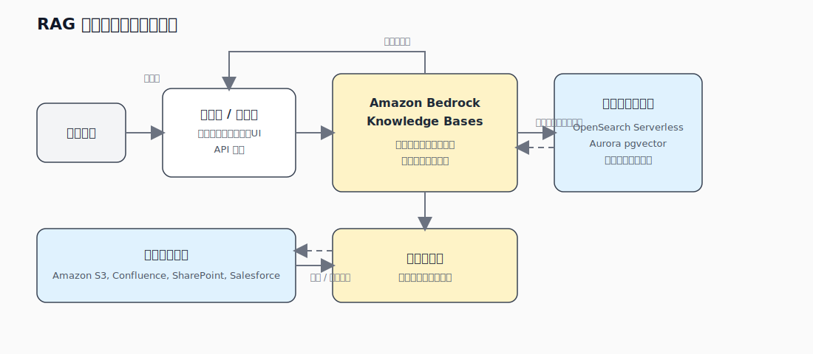
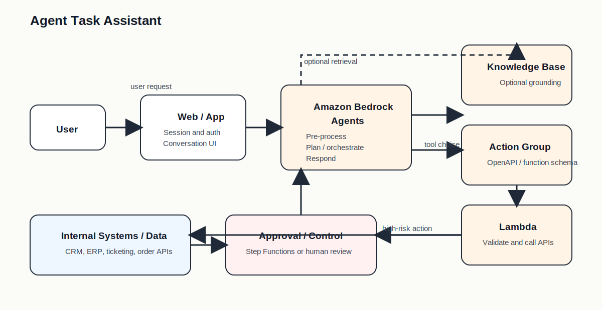
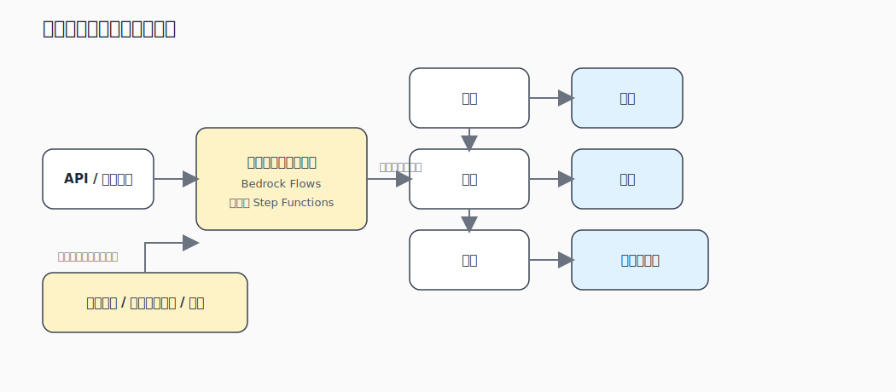
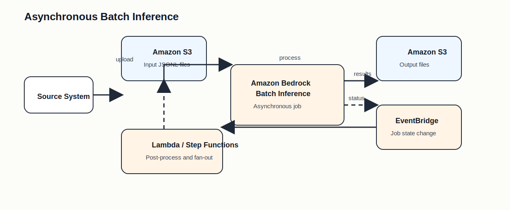

# 付録: 実務パターン集

## この付録の位置づけ

- 本編は `機能` と `判断軸` を中心に整理している
- この付録は `アプリ全体の形` で見直すための補助
- 今後はアーキテクチャ以外に、アンチパターン、導入順序、運用チェックも追記できる形で育てる
- 今回は `代表アプリケーションアーキテクチャ` に絞る

## まず結論

- `社内文書を根拠付きで答える` なら `Knowledge Bases` を中核にした RAG 型
- `会話しながら検索や更新まで進める` なら `Agents + Action Group` 型
- `手順が決まっていて、再試行や承認が重要` なら `Flows / Step Functions` 型
- `大量件数をあとでまとめて処理する` なら `Batch inference` 型

## まず切る問い

| 問い | 第一候補 |
| --- | --- |
| 最新の独自文書を使って答えるか | `Knowledge Bases` |
| 会話しながら外部 API を実行するか | `Agents` |
| ステップ順や分岐が最初から決まっているか | `Flows` / `Step Functions` |
| 即時応答は不要で、大量件数を安く回したいか | `Batch inference` |

## 1. RAG 型ナレッジアシスタント

### 典型アプリ

- 社内 FAQ
- 製品マニュアル検索
- コールセンター支援
- 規程、手順書、設計書の検索付きチャット

図: AWS 公式情報をもとに再構成

### 構成の見方

- `S3` や接続先データを `Knowledge Bases` に接続する
- 取り込み時に `チャンク化 -> 埋め込み生成 -> ベクトルストア格納` を進める
- 実行時は `検索 -> 関連文脈の取得 -> FM へ文脈付きで入力 -> 回答生成` の順で動く
- アプリ側は認証、会話 UI、呼び出し制御を担う

### この形が自然な要件

- `最新文書を使いたい`
- `再学習は避けたい`
- `回答の根拠を示したい`
- `文書更新を取り込みで反映したい`

### 追加で足す部品

- `Guardrails`
  不適切出力や PII 対策
- `metadata filtering`
  部門、日付、機密区分で絞る
- `reranking`
  上位文書の精度を上げる
- `CloudWatch`、`CloudTrail`
  取得品質、推論、監査を追う

### 向かない場面

- 主役が `文書検索` ではなく `外部 API 実行`
- 固定ルールだけで十分で、検索が不要
- 口調変更や出力形式の安定化が中心課題で、知識更新が主目的ではない

### 試験での見分け方

- `社内文書`
- `最新情報`
- `引用`
- `再学習したくない`
- `独自データを推論時に使う`

出典: [Knowledge Bases 概要](https://docs.aws.amazon.com/bedrock/latest/userguide/knowledge-base.html), [How knowledge bases work](https://docs.aws.amazon.com/bedrock/latest/userguide/kb-how-it-works.html), [AWS Prescriptive Guidance: Grounding and RAG](https://docs.aws.amazon.com/prescriptive-guidance/latest/agentic-ai-serverless/grounding-and-rag.html), [AWS Prescriptive Guidance: Knowledge bases for Amazon Bedrock](https://docs.aws.amazon.com/prescriptive-guidance/latest/retrieval-augmented-generation-options/rag-fully-managed-bedrock.html)

## 2. Agent 型業務実行アシスタント

### 典型アプリ

- 予約変更アシスタント
- 受注、注文、在庫確認
- 社内申請ナビゲーション
- CRM やチケットシステム連携

図: AWS 公式情報をもとに再構成

### 構成の見方

- `Agents` がユーザー入力を受けて、前処理、計画、ツール実行、応答生成を進める
- `Action Group` で OpenAPI schema や function schema を定義する
- 必要に応じて `Lambda` が業務 API を呼ぶ
- `Knowledge Bases` を付ければ、実行前に根拠文書も参照できる
- 返金や更新のような高リスク処理は `Step Functions` や人手承認へ逃がす

### この形が自然な要件

- `会話しながら不足項目を聞き返したい`
- `検索だけでなく実行まで進めたい`
- `状況によって呼ぶツールが変わる`
- `複数の業務 API をまたぐ`

### 追加で足す部品

- `IAM`
  Action Group や Lambda に最小権限
- `Guardrails`
  禁止トピックや危険操作の抑止
- `Trace` と `CloudWatch`
  どのステップで失敗したかを追う
- `human-in-the-loop`
  削除、返金、設定変更を自動化しすぎない

### 向かない場面

- 処理順が最初から固定
- 単発推論だけで完了する
- API 実行よりも検索精度が主役

### 試験での見分け方

- `予約`
- `在庫確認`
- `顧客情報更新`
- `不足パラメータを聞き返す`
- `複数ツールを使ってタスク完了まで進める`

出典: [How Amazon Bedrock Agents works](https://docs.aws.amazon.com/bedrock/latest/userguide/agents-how.html), [AWS Prescriptive Guidance: Amazon Bedrock Agents](https://docs.aws.amazon.com/prescriptive-guidance/latest/agentic-ai-frameworks/bedrock-agents.html), [AWS Guidance: Building Custom Chatbots for Order Recommendations Using Agents for Amazon Bedrock](https://aws.amazon.com/solutions/guidance/building-custom-chatbots-for-order-recommendations-using-agents-for-amazon-bedrock/)

## 3. 固定手順ワークフロー型

### 典型アプリ

- 問い合わせ分類 -> 要約 -> 回答案生成
- 文書要約 -> ルール検査 -> 承認依頼
- チケット振り分け -> ナレッジ検索 -> 通知
- 下書き生成 -> レビュー -> 公開

図: AWS 公式情報をもとに再構成

### 構成の見方

- `Flows` はノードをつないで生成 AI ワークフローを作る
- `Step Functions` は AWS サービス連携、分岐、再試行、タイムアウト、承認を強く制御する
- 典型は `分類 -> 検索 / 前処理 -> モデル呼び出し -> 検証 -> 承認 / 通知`
- 1 つのステップが失敗しても、ワークフロー単位で再実行や補償を設計しやすい

### この形が自然な要件

- `順序が固定`
- `失敗時の再試行ルールが必要`
- `人手承認を入れたい`
- `監査証跡を残したい`

### Flows と Step Functions の切り分け

- `Flows`
  生成 AI ノード中心で素早く組みたい
- `Step Functions`
  再試行、分岐、タイムアウト、承認、他サービス連携まで厳密に制御したい

### 向かない場面

- 実行中にモデルが柔軟に再計画することが主役
- 会話の流れでツール選択が変わる

### 試験での見分け方

- `固定順序`
- `承認`
- `再試行`
- `分岐`
- `監査`

出典: [How Amazon Bedrock Flows works](https://docs.aws.amazon.com/bedrock/latest/userguide/flows-how-it-works.html), [Step Functions と Amazon Bedrock の統合](https://docs.aws.amazon.com/step-functions/latest/dg/connect-bedrock.html), [AWS Prescriptive Guidance: Prompt chaining saga patterns](https://docs.aws.amazon.com/prescriptive-guidance/latest/agentic-ai-patterns/prompt-chaining-saga-patterns.html)

## 4. 非同期バッチ推論型

### 典型アプリ

- 商品説明の一括生成
- 既存 FAQ の要約と分類
- 夜間バッチでのタグ付け
- 大量コンテンツの再生成

図: AWS 公式情報をもとに再構成

### 構成の見方

- 入力データを `S3` に置く
- `Batch inference job` が非同期でまとめて処理する
- 出力は `S3` に書き戻す
- ジョブ状態は `EventBridge` で受け、後続処理を `Lambda` や `Step Functions` へ渡す
- ネットワーク要件が厳しいなら VPC 構成も追加する

### この形が自然な要件

- `大量件数`
- `即時応答は不要`
- `夜間や定期処理`
- `結果を後でまとめて使う`

### 重要な注意

- `Provisioned Throughput` のモデルは対象外
- チャット UI のような即時応答には向かない
- 後続システム連携まで含めて、完了通知と再処理を設計する

### 向かない場面

- 1 件ずつユーザー対話で返すアプリ
- 処理完了まで待てない業務

### 試験での見分け方

- `大量件数`
- `非同期`
- `S3 に入力 / 出力`
- `夜間処理`
- `結果はあとで回収`

出典: [Batch inference 概要](https://docs.aws.amazon.com/bedrock/latest/userguide/batch-inference.html), [Monitor batch inference jobs](https://docs.aws.amazon.com/bedrock/latest/userguide/batch-inference-monitor.html), [Monitor Amazon Bedrock job state changes using Amazon EventBridge](https://docs.aws.amazon.com/bedrock/latest/userguide/monitoring-eventbridge.html), [Protect batch inference jobs using a VPC](https://docs.aws.amazon.com/bedrock/latest/userguide/batch-vpc.html)

## 比較の軸

| パターン | 主役 | 強い要件 | 弱い要件 |
| --- | --- | --- | --- |
| `RAG 型` | `Knowledge Bases` | 最新知識、引用、社内文書活用 | 外部 API 実行 |
| `Agent 型` | `Agents` | 会話しながら検索と実行 | 固定手順の厳密制御 |
| `固定手順型` | `Flows` / `Step Functions` | 再試行、承認、監査、分岐 | 柔軟な再計画 |
| `バッチ型` | `Batch inference` | 大量件数、非同期、一括処理 | 即時応答 |

## Active Recall

- 社内規程を根拠付きで答えたいが、モデルの再学習は避けたい。第一候補は何か。
- 予約変更アシスタントで、会話の中で不足情報を聞き返し、最後に外部 API を呼びたい。第一候補は何か。
- 問い合わせを分類し、検索し、要約し、最後に人手承認へ回す。どの型が自然か。
- 商品説明を毎晩 10 万件まとめて生成したい。どの型が自然か。
- `最新知識` が主役なのに `fine-tuning` を選ぶのはなぜずれやすいか。
- `固定順序` の処理なのに `Agents` を選ぶと、どこが過剰になりやすいか。
